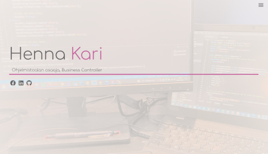

## LUT-Front-End
### Software Development Skills: Front-End

#### Henna-Riikka Kari

### Content:
This repository includes my course material for the LUT course Software Development Skills : Front-End. 

Main folders and their content:
* FrontEnd-exercises: exercises done based on tutorial Responsive Portfolio Website (Traversy Media) and the 'John Doe' -portfolio

* LearningDiary: folder includes a learning diary written by myself during the work 

* MyProject-Portfolio: this is my version of the 'John Doe' -portfolio 

### Have a look at my portfolio here:

> Portfolio - Henna Kari [Portfolio](https://hennakari.github.io/Portfolio/)

##### Link to my original GitHub page

> GitHub - Henna Kari - Portfolio [Portfolio](https://github.com/hennakari/Portfolio)

##### Additional parallax-page is here (just because it's so cool)

> Parallax live-version [Parallax](https://hennakari.github.io/Parallax/)
> Source code [Parallax](https://github.com/hennakari/Parallax)

### Short video of my project can be found here::

> Video: My Project [Portfolio](linkki)

### And a link to the origininal tutorial

> Responsive Portfolio Website - Traversy Media [Responsive Portfolio Website](https://www.youtube.com/watch?v=gYzHS-n2gqU)
